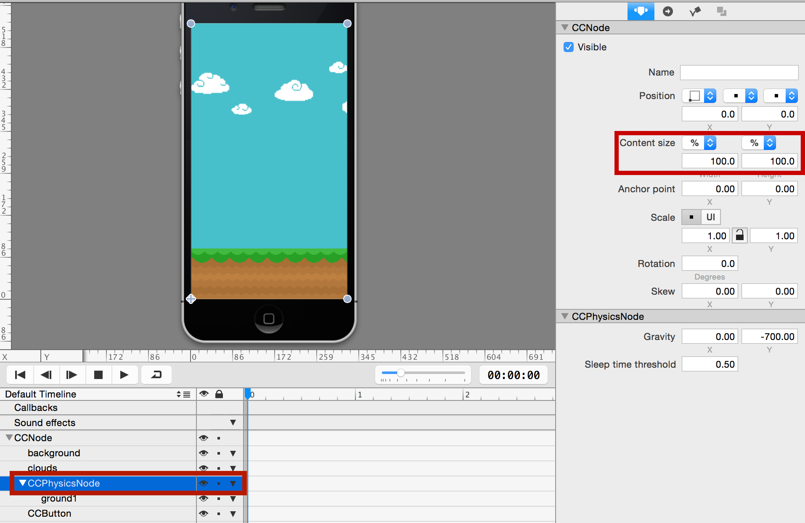
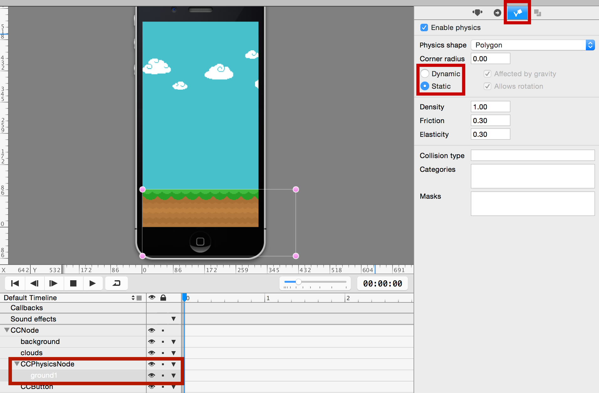
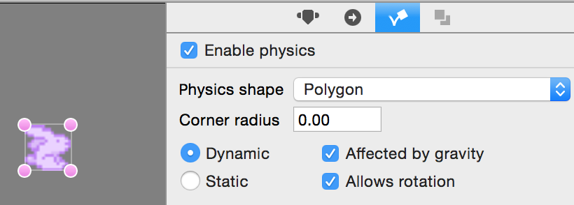
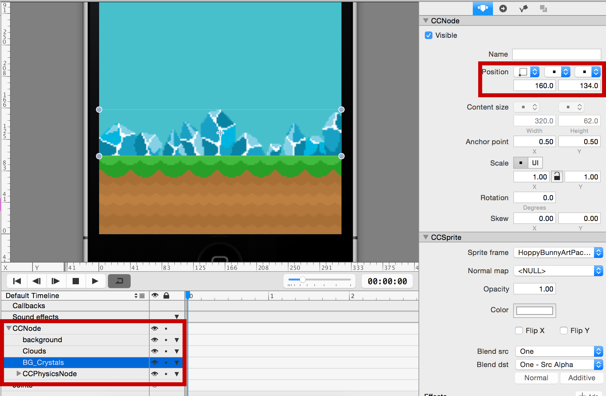
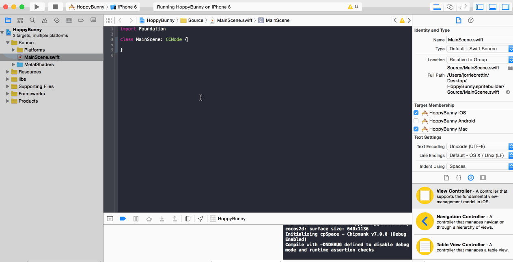

Next, you'll enable physics on the bunny and add a physics node to the scene.

##Add the physics node

Because the *Hoppy Bunny Swift* game uses physics, you need to add a *CCPhysicsNode*. 

> [action]
> Open *MainScene.ccb* and drag a *Physics Node* from the Node Library View onto the stage. Set the size of the Physics Node to be a 100% of the parent's size:
>
> 

#Make the ground static

> [action]
> Select the ground node. On its Item Physics tab, enable physics and make it a *Static* body.
>
> 
>
> Drag the ground node into the timeline so it becomes a child of the *CCPhysicsNode*. Remember that every Node that has physics enabled needs to be below a *CCPhysicsNode* in the hierarchy; otherwise, it will not behave like a physics object, nor will it collide with other physics bodies.

#Enable bunny physics

> [action]
> Open *Hero.ccb* and select the Bunny sprite. Switch to the Item Physics tab and check the enable physics checkbox. Make sure the body type is set to *Dynamic*.
>
> 

#Add the bunny to the world

> [action]
> To add the bunny to the game, drag the *Hero.ccb* file onto the stage. This will automatically create a *Sub File* node referencing the *Hero.ccb* contents. Make the Bunny a child of the CCPhysicsNode (drag & drop in the timeline to reorder it).

Sometimes *Sub Files* are not displayed properly when initially placed into a scene.

> [info]
> If a *Sub File* is not visible, publish your project. If it is still not visible, check its order in the animation timeline as it may be hidden under something else in the scene.

#Add the crystals

> [action]
> Before you run the game, let's add some crystals above the ground to complete the visual appeal of *Hoppy Bunny Swift* by adding `bg_crystals.png` onto the stage:
>
> 
>
> Set the *position* of the crystal to `(160.0, 134.0)`. Make sure all the decorative elements are placed above the *CCPhysicsNode* in the timeline. This will ensure that the hero and ground will be drawn in front of the background images like the clouds and crystals.

Like the ground's position, the crystals are being positioned where we think they look best. It is fine if you want to choose a different y-value for their position!

#Check your progress

You are ready to publish your project and run the App from Xcode! When you run your project, you should see the bunny slowly sailing down and coming to a rest on the ground:

> [info]
> Remember, to open your project in Xcode, select File -> Open Project in Xcode. While in Xcode, you can run your project by going selecting Product -> Run.

Great! Now let's get our bunny hopping!