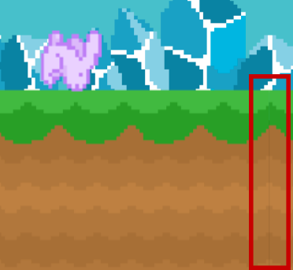

Moving forward with any decent game, you will want to use Sprite Sheets (better known as Texture Atlas) for your image resources.

> [action]
> In this project you can simply right-click the *HoppyBunnyArtPack* folder in SpriteBuilder, then select *Make Smart Sprite Sheet* to convert it to a sprite sheet. This will combine all images to a single texture, conserving precious runtime memory while also speeding up drawing of sprites using those images.

Whether you use PNG or PVR as the sprite sheet format, you will observe a common "black line" artifact that can pretty much show up anywhere in tiled graphics but is surprisingly simple to fix. First, see the highlighted issue - you may have seen that somewhere, sometime before:

> [action]
> To fix this quickly, open *MainScene.swift* and navigate to the *update* method. Add the following code just below the lines that assign values to the *hero.position* and *gamePhysicsNode.position*:
>
>        gamePhysicsNode.position = ccp(round(gamePhysicsNode.position.x),
>                                    round(gamePhysicsNode.position.y))

This rounds the physics node's position to the nearest integer coordinates. A position like 115.763, 213.298 is then rounded to 116.0, 213.0. This ensures the position is on pixel boundaries, preventing the subpixel rendering artifacts above.

Now if you consider that the positions in Cocos2D is in points, not pixels, you'll know the above code does in fact round to the nearest point. On Retina devices this would limit the scrolling position (or rather: precision) to point coordinates, i.e. not using the full resolution of the Retina screen. You'll hardly notice the difference, if at all. On the other hand, moving the position of the physics node to actual pixel boundaries (Retina or not) is still quite simple.

> [action]
> Replace the above artifact fix code with the following enhanced code that properly rounds to Retina pixel boundaries:
>
>        let scale = CCDirector.sharedDirector().contentScaleFactor
>        gamePhysicsNode.position = ccp(round(gamePhysicsNode.position.x * scale) / scale, round(gamePhysicsNode.position.y * scale) / scale)

That's easy to explain. The content scale factor is 1.0 on non-Retina devices, and 2.0 on all Retina devices. On non-Retina devices the code has the exact same result - multiply and divide by 1.0 makes no difference. But on Retina devices, the position coordinates are first multiplied by 2.0 (i.e. 213.298 becomes 426.596) and then the rounding takes effect (new value: 427.0). Then the rounded value is divided by 2.0, resulting in a value whose fractional part is either .0 or .5 (here: 213.5). Since the position is in points, not pixels, and the Retina pixels resolution is twice the point resolution, any .5 coordinate is also on an exact pixel boundary.

You can apply this "black line" artifact to any situation where they occur. Just keep in mind that you'll want to apply the fix to "parent-most" node whose position changes, and you may need to apply it on child nodes as well. For instance if the player were a tile itself, it might also need to have its position rounded to the nearest pixel coordinate.

#Solution

The solution to this [tutorial is available on GitHub](https://github.com/MakeSchool/HoppyBunny-SpriteBuilder-Swift).

